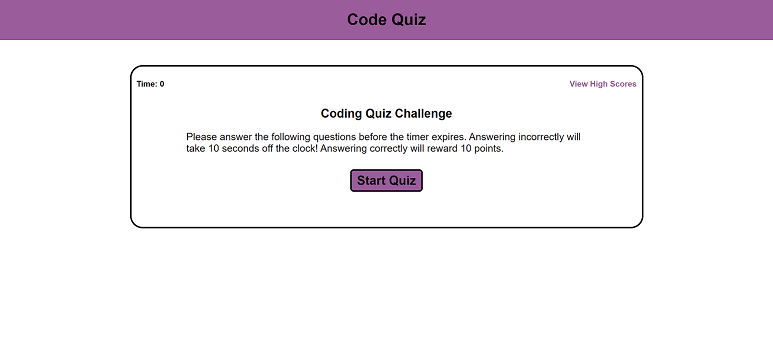
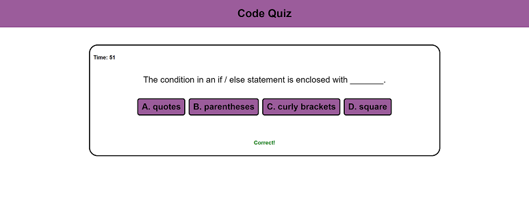
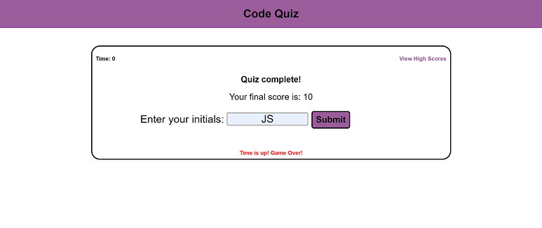

# Challenge 4: Code Quiz

## Description

With this project, my goal was to create a clean, working quiz, that would be useful for a student to test their knowledge and compare it to previous scores or other user's scores. This project uses local storage to store the user's initials score and save it to the browser, so when another user tests their knowledge, they can see previous high scores in comparison with theirs. The quiz is time, and when a question is answered incorrectly, time is subtracted from the quiz. If the user gets the answer correct, then they are awarded ten points. Points are displayed at the end of the quiz.

## User Story

* AS A coding boot camp student
* I WANT to take a timed quiz on JavaScript fundamentals that stores high scores
* SO THAT I can guage my progress compared to my peers

## Acceptance Criteria

* GIVEN I am taking a code quiz
* WHEN I click the start button
* THEN a timer starts and I am presented with a question
* WHEN I answer a question
* Then I am presented with another question
* WHEN I answer a question incorrectly
* THEN time is subtracted from the clock
* WHEN all questions are answered or the timer reaches 0
* THEN the game is over
* WHEN the game is over
* THEN I can save my initials and score

## Technology Used

HTML/CSS/JavaScript

## Installation

N/A

## Deployed Application

The deployed application can be found at this link:

## Assets

The following images represent the website's appearance:

## License

Please refer to the LICENSE in the repo